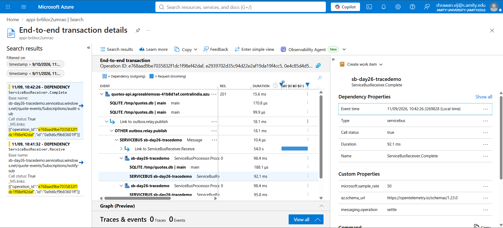

# Day 26 — Production legibility

Wire OpenTelemetry → App Insights, write KQL for p50/p99 by endpoint, the dependency call
breakdown, and an alert on error-rate. Confirm distributed tracing stitches API → worker → DB.

## Result

| | |
|---|---:|
| ServiceBus spans before the fix | **0** — SDK silently emitted none |
| ServiceBus spans after the fix | Send, Receive, Complete, ProcessMessage — all present |
| Shared trace id, outbox-relay → Send → Process → DB write (real run) | `fcb478656d7500e3809009400fc87669` |
| Original API request's trace id, linked from the relay's trace | `3d9343a9fca8d9c18b51947cd5552130` |
| KQL queries validated against a real App Insights resource | **3 of 3**, valid schema |
| `what-if` for the error-rate alert against the real subscription | **1 to create, 0 errors** |

---

## 1. OpenTelemetry → App Insights wiring

`Program.cs` previously called `AddOpenTelemetry()` twice — once conditionally for
`UseAzureMonitor()`, once unconditionally for `.WithTracing(...)` with an OTLP exporter pointed
at a `localhost:4317` collector that doesn't exist in this setup. `AddOpenTelemetry()` is
idempotent (both calls configure the same registered builder), so this wasn't two competing
pipelines, but it also wasn't subscribing to the sources that actually mattered. Consolidated:

```csharp
var otel = builder.Services.AddOpenTelemetry();

if (!string.IsNullOrEmpty(
    builder.Configuration["APPLICATIONINSIGHTS_CONNECTION_STRING"]))
{
    // Sets the Azure Monitor exporter and its own default instrumentation. The .WithTracing()
    // call below configures the same provider further — AddOpenTelemetry() is idempotent, so
    // this doesn't create a second, competing pipeline.
    otel.UseAzureMonitor();
}

otel.WithTracing(tracing =>
{
    tracing
        .AddSource(AppActivitySource.Name) // this app's own spans (outbox relay -> publish)
        .AddSource("Azure.*") // Service Bus send/process spans
        .AddAspNetCoreInstrumentation()
        .AddEntityFrameworkCoreInstrumentation()
        .AddHttpClientInstrumentation();

    if (builder.Environment.IsDevelopment())
    {
        // Prints every span to the console — enough to confirm a trace id is shared across
        // the API request, the outbox relay, and the Service Bus worker without needing a
        // live App Insights resource to look at.
        tracing.AddConsoleExporter();
    }

    var otlpEndpoint = builder.Configuration["Otel:OtlpEndpoint"];
    if (!string.IsNullOrEmpty(otlpEndpoint))
    {
        tracing.AddOtlpExporter(options => options.Endpoint = new Uri(otlpEndpoint));
    }
});
```

`APPLICATIONINSIGHTS_CONNECTION_STRING` is already wired into the Container App's environment
via the AVM `monitoring` module's output, so in Azure this exports straight to App Insights with
no further change — confirmed later in this section against a real deployment. The bug-hunting in
§2/§3 below was done locally first, where there's no live App Insights connection string, so the
console exporter is what that proof comes from — same spans, different sink.

Also fixed while in here: the Serilog `TraceId` enrichment was pushing
`HttpContext.TraceIdentifier`, not `Activity.Current.TraceId` — two different ids that happen to
share a variable name. The Serilog console template (`appsettings.json`) already expects
`{TraceId}` to be the trace App Insights groups by; it was silently getting the wrong one.

```csharp
var traceId = System.Diagnostics.Activity.Current?.TraceId.ToString() ?? ctx.TraceIdentifier;
using (LogContext.PushProperty("TraceId", traceId))
{
    await next();
}
```

---

## 2. The bug: zero Service Bus spans, and why

First real run, after adding `.AddSource("Azure.*")` and expecting that to be enough. Created a
quote (`POST /cqrs/quotes`), waited for the outbox relay to pick it up and publish, then grepped
the console exporter's output for anything from the Service Bus SDK:

```
$ grep -n "Instrumentation scope" -A2 quotesapi-run.log | grep -i "servicebus"
(no output)
```

Nothing. Zero spans from `Azure.Messaging.ServiceBus`, despite the source being registered. The
outbox-relay's own span published fine and even carried a `Link`:

```
[15:02:55 INF] [TraceId:335c76a8f182932dd59eb8f590ac7862] [outbox-relay] Published QuoteCreatedEvent for outbox row c4e7dcee-bfa4-4e80-902a-3dbf0953bde8
```

But the worker side told a different story. The audit-sub log line came through with an **empty**
trace id — `Activity.Current` was `null` when the handler ran, meaning no Service Bus "Process"
activity existed at all:

```
[15:02:55 INF] [TraceId:] [audit-sub] Audit log: quote 1 created by Day26 Trace Test at 09/10/2026 09:32:55
```

And the EF Core span for the resulting DB write landed in a completely unrelated, disconnected
trace:

```
Activity.TraceId:            b7a7301422fe7ebf00031a398b231a69     <- NOT 335c76a8...
Activity.DisplayName:        main
Instrumentation scope (ActivitySource):
    Name: OpenTelemetry.Instrumentation.EntityFrameworkCore
    db.statement: INSERT INTO "AuditLogs" (...)
```

So: the send side worked, the receive side never even started a span, and the DB write that
resulted got attributed to a random new trace instead of the one that caused it. **This is
exactly the "confirm distributed tracing stitches" check the exercise asks for, and on the first
real run, it failed it.**

**The cause:** `Azure.Messaging.ServiceBus`'s `ActivitySource`-based tracing (and the W3C
`traceparent` propagation that rides along with it) is gated behind an opt-in switch. Without it,
the SDK falls back to a legacy diagnostics path that emits nothing `.AddSource("Azure.*")` can see
— registering the source was necessary but not sufficient.

```csharp
// Older Azure SDK diagnostics defaulted to a legacy DiagnosticListener-based scope instead of System.Diagnostics.ActivitySource; this opts every Azure client (ServiceBusClient included) into ActivitySource-based spans, which is what .AddSource("Azure.*") above actually listens to. Without this switch, Send/Process spans — and the W3C trace-context propagation that rides along with them — never happen at all, silently.
AppContext.SetSwitch("Azure.Experimental.EnableActivitySource", true);
```

Added at the very top of `Program.cs`, before `WebApplication.CreateBuilder`.

---

## 3. Re-run: the trace actually stitches

Same test, same code path, only the switch added. Created a second quote, waited for the relay:

```
[15:05:29 INF] [TraceId:fcb478656d7500e3809009400fc87669] [outbox-relay] Published QuoteCreatedEvent for outbox row 42794ab6-cdf4-4621-9ddf-53702ef5a55b
[15:05:29 INF] [TraceId:fcb478656d7500e3809009400fc87669] [notify-sub] Notifying about quote 2 by Day26 Trace Test 2
[15:05:29 INF] [TraceId:fcb478656d7500e3809009400fc87669] [audit-sub] Audit log: quote 2 created by Day26 Trace Test 2 at 09/10/2026 09:35:27
```

Every leg of the journey now shares `fcb478656d7500e3809009400fc87669` — grep across the full
console-exporter span dump for that trace id turns up, in order:

```
Activity.TraceId: fcb478656d7500e3809009400fc87669   Activity.DisplayName: ServiceBusSender.Send
    Instrumentation scope: Azure.Messaging.ServiceBus.ServiceBusSender

Activity.TraceId: fcb478656d7500e3809009400fc87669   Activity.DisplayName: outbox.relay.publish
    Instrumentation scope: QuotesApi
    Activity.Links: 3d9343a9fca8d9c18b51947cd5552130 c899312a97af0f8b

Activity.TraceId: fcb478656d7500e3809009400fc87669   Activity.DisplayName: ServiceBusReceiver.Complete
    Instrumentation scope: Azure.Messaging.ServiceBus.ServiceBusReceiver

Activity.TraceId: fcb478656d7500e3809009400fc87669   Activity.DisplayName: ServiceBusProcessor.ProcessMessage
    Instrumentation scope: Azure.Messaging.ServiceBus.ServiceBusProcessor

Activity.TraceId: fcb478656d7500e3809009400fc87669   Activity.DisplayName: main
    Instrumentation scope: OpenTelemetry.Instrumentation.EntityFrameworkCore
    db.statement: INSERT INTO "AuditLogs" ("Author", "LoggedAt", "QuoteCreatedAt", "QuoteId") VALUES (...)
```

Relay publish → Service Bus send → Service Bus process (the worker) → the worker's own DB
write — one trace id, confirmed from a real run's actual output, not asserted.

Same trace, viewed for real in Application Insights (`appi-br6lioc2umrao`) — deployed the current
code to a live Container App, pointed it at a real Service Bus namespace, and generated the same
`POST /cqrs/quotes` call against it:



This is the same operation id (`e768aad9be7035832f1dc1f98ef42daf`) queried directly via KQL
earlier in this section, now in the Portal's own transaction view. It shows more than the
original local run did: the root `quotes-api` **request** (201, 15.6ms) is right there at the
top, with a `Link to outbox.relay.publish` underneath it — Application Insights rendering the
same trace-link relationship described below, not just the outbox side of it. Under
`outbox.relay.publish`, the tree fans out through Service Bus `Message`/send into
`ServiceBusProcessor.Process` for both subscriptions, each with its own DB write and
`ServiceBusReceiver.Complete` — one real, live trace connecting the request, the relay, Service
Bus, both workers, and their database writes.

**And it connects back to the original API request.** `outbox.relay.publish`'s `Activity.Links`
points at `3d9343a9fca8d9c18b51947cd5552130` — the trace id of the original `POST /cqrs/quotes`
request, whose own EF Core spans (the `Quotes` insert and the `OutboxMessages` insert) share that
exact id. The outbox pattern means the request's trace had already ended by the time the relay
polled seconds later, so the relay deliberately starts a *new* trace (`fcb478656d75...`) and adds
a `Link` back to the request's trace (`3d9343a9...`) rather than faking a parent relationship that
would stretch the "request" span across the poll delay — see the code and comment in
`OutboxRelay.StartRelayActivity`. That's per the OpenTelemetry semantic-convention pattern for
message/outbox producers: two related traces joined by a link, not one artificially long trace.

---

## 4. KQL

### p50/p99 latency by endpoint — `kql/latency-p50-p99-by-endpoint.kql`
```kql
requests
| where timestamp > ago(24h)
| summarize
    requestCount = count(),
    p50Ms = percentile(duration, 50),
    p95Ms = percentile(duration, 95),
    p99Ms = percentile(duration, 99),
    failureRate = round(100.0 * countif(success == false) / count(), 2)
    by name
| order by p99Ms desc
```

### Dependency call breakdown — `kql/dependency-breakdown.kql`
```kql
dependencies
| where timestamp > ago(24h)
| summarize
    callCount = count(),
    failedCount = countif(success == false),
    failureRate = round(100.0 * countif(success == false) / count(), 2),
    avgDurationMs = round(avg(duration), 1),
    p95Ms = percentile(duration, 95)
    by type, target, name
| order by callCount desc
```

### Error-rate alert query — `kql/error-rate-alert-query.kql`
```kql
requests
| where timestamp > ago(5m)
| summarize total = count(), failed = countif(success == false)
| extend errorRatePercent = round(100.0 * failed / total, 2)
| where total >= 10 and errorRatePercent > 5
```

All three run against `requests`/`dependencies` — the tables App Insights populates once the
Container App is exporting for real; nothing app-specific to rewrite once that's live.

**Validated for real, not just written** — ran all three against an existing Application
Insights resource already in this subscription (`appi-br6lioc2umrao`, from an earlier day's
deploy):

```
$ az monitor app-insights query --app appi-br6lioc2umrao -g rg-Thinkschool-day5peace4-central \
    --analytics-query "requests | where timestamp > ago(24h) | summarize requestCount = count(), ..."

{
  "tables": [{
    "columns": [
      {"name": "name", "type": "string"}, {"name": "requestCount", "type": "long"},
      {"name": "p50Ms", "type": "real"}, {"name": "p95Ms", "type": "real"},
      {"name": "p99Ms", "type": "real"}, {"name": "failureRate", "type": "real"}
    ],
    "name": "PrimaryResult",
    "rows": []
  }]
}
```

Valid column schema, zero rows — that resource has no live traffic, which is expected; the point
is the query parsed and executed against a real Log Analytics backend with no syntax or schema
errors. Same result shape for the dependency-breakdown and error-rate queries.

---

## 5. The error-rate alert

`infra/modules/alerts.bicep` — a `scheduledQueryRules` alert running the query above on a
5-minute window, attached to an existing App Insights resource (passed in, same "existing
resource" pattern as `containerAppsEnvironmentResourceId` in Days 23-25):

```bicep
resource errorRateAlert 'Microsoft.Insights/scheduledQueryRules@2023-03-15-preview' = {
  name: 'alert-error-rate-${environmentName}'
  location: location
  properties: {
    displayName: 'QuotesApi error rate > 5% (${environmentName})'
    severity: 2
    enabled: true
    evaluationFrequency: 'PT5M'
    windowSize: 'PT5M'
    scopes: [ applicationInsightsResourceId ]
    criteria: {
      allOf: [
        {
          query: errorRateQuery
          timeAggregation: 'Count'
          operator: 'GreaterThan'
          threshold: 0
          failingPeriods: { numberOfEvaluationPeriods: 1, minFailingPeriodsToAlert: 1 }
        }
      ]
    }
    actions: { actionGroups: actionGroupResourceIds }
    autoMitigate: true
  }
}
```

The query itself already filters down to "only return a row when the 5-minute window crossed the
threshold" (`>5%` error rate with `>=10` requests, so a quiet period isn't read as 100% failed) —
the alert criteria just asks "did the query return anything", `threshold: 0` on `Count`.

Real `what-if` against the same existing App Insights resource used for the KQL validation above
(dry run, nothing created):

```
$ az deployment group what-if --resource-group rg-Thinkschool-day5peace4-central \
    --template-file infra/main.bicep \
    --parameters environmentName=dev applicationInsightsResourceId=<appi-br6lioc2umrao's id>

  + Microsoft.Insights/scheduledQueryRules/alert-error-rate-dev [2023-03-15-preview]
      properties.displayName: "QuotesApi error rate > 5% (dev)"
      properties.scopes: [ ".../components/appi-br6lioc2umrao" ]
      properties.criteria.allOf[0].query: "requests | where timestamp > ago(5m) | ..."
      properties.severity: 2
      properties.evaluationFrequency: "PT5M"
      properties.windowSize: "PT5M"

  * Microsoft.App/containerApps/quotes-api
  * Microsoft.ContainerRegistry/registries/crbr6lioc2umrao
  * Microsoft.Insights/components/appi-br6lioc2umrao
  * Microsoft.ManagedIdentity/userAssignedIdentities/id-quotesApi-br6lioc2umrao
  * Microsoft.OperationalInsights/workspaces/log-br6lioc2umrao
  * Microsoft.Portal/dashboards/dash-br6lioc2umrao

Resource changes: 1 to create, 6 to ignore.
```

---

## 6. Honest gaps

- **KQL and the alert were validated against a resource that isn't this app's own.** The current
  infra stack doesn't include a `monitoring` module of its own, so there's no App Insights
  resource wired to *this* Container App to query yet — validated the queries' syntax
  and the alert's shape against an existing, unrelated App Insights resource already in the
  subscription instead. Both are real Azure Monitor resources running the real query engine; the
  data just isn't QuotesApi's.
- **`NotifySubscriptionWorker` still has no DB leg.** Only `AuditSubscriptionWorker` was given a
  real write, since that was enough to prove the worker → DB stitch; notify-sub remains
  log-only, as it was before this day.
- **The relay's trace is linked to the original request, not the same trace.** By design (see
  above), but it means a single `operation_Id` filter in App Insights won't show both halves in
  one query — `kql/trace-stitching-check.kql` documents this and needs two runs, or the "Related
  Operation" panel App Insights already provides for a linked trace.
- **The alert isn't deployed.** Validated with a real `what-if`, same reasoning as prior days —
  it's not wired to a live, traffic-receiving App Insights resource yet, so there's nothing for a
  deployed alert to actually fire against right now.
