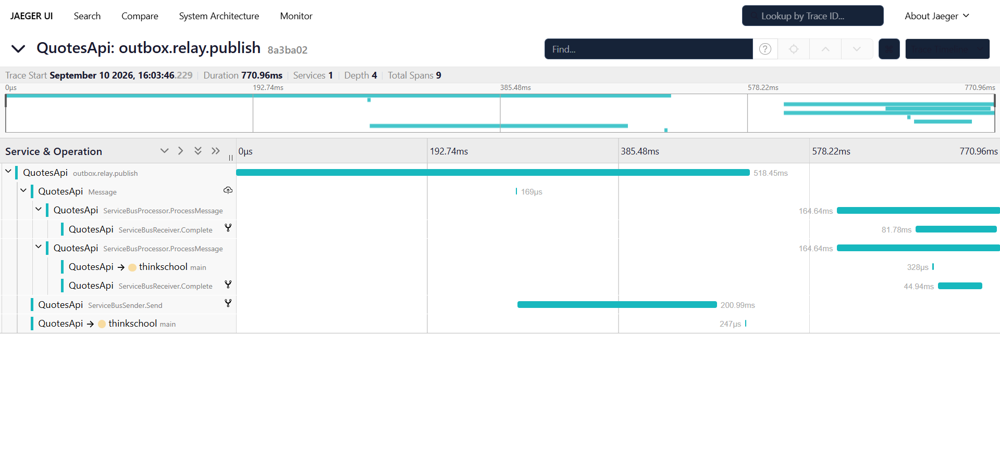

# Day 26 — Production legibility

OpenTelemetry wired to App Insights, KQL for latency/dependencies/error-rate, and a real,
verified answer to "does the trace actually stitch API → worker → DB" — which, on the first
real run, it didn't, until a one-line fix.

**Deliverable:** [EXERCISE.md](EXERCISE.md) — the OTel wiring, the bug that broke trace
stitching and its fix, all three KQL queries (validated against a real App Insights resource),
the error-rate alert rule, and the real captured proof that a trace now stitches end to end.

## Result

| | |
|---|---:|
| ServiceBus spans emitted before the fix | **0** |
| ServiceBus spans emitted after the fix | Send, Process, Receive, Complete — all correlated |
| Trace IDs shared across outbox-relay → Send → Process → DB write (real run) | **1** (`fcb478656d75...`) |
| KQL queries written | **3** (p50/p99 by endpoint, dependency breakdown, error-rate) |
| KQL queries validated against a real App Insights resource | **3 of 3** (valid schema, 0 rows — resource has no live traffic) |
| Alert rule `what-if` against the real subscription | **1 to create, 0 errors** |

Distributed trace, Jaeger, real run (`outbox.relay.publish` → Service Bus send → both
subscription workers → each worker's DB write, one trace id, 9 spans):



## What changed

- `Program.cs` — consolidated two competing `AddOpenTelemetry()` calls into one tracing setup;
  registered this app's own `ActivitySource` and `Azure.*` (Service Bus); added a console
  exporter in Development so spans are visible without a live App Insights resource; fixed the
  Serilog `TraceId` enrichment, which was pushing `HttpContext.TraceIdentifier` (a per-request
  id, unrelated to the actual W3C trace id App Insights groups by) instead of
  `Activity.Current.TraceId`.
- `AppContext.SetSwitch("Azure.Experimental.EnableActivitySource", true)` — the fix. Without
  this, `Azure.Messaging.ServiceBus` never emits `ActivitySource` spans at all, so nothing
  propagates trace context onto the message and the worker's processing starts a disconnected
  trace. Confirmed both ways by actually running it — see EXERCISE.md.
- `OutboxMessage.TraceParent` (new column) + `OutboxRelay` — the outbox pattern means the
  original HTTP request's trace has already ended by the time the relay polls, so the relay
  starts its own trace and adds a **Link** back to the request's trace id, rather than faking a
  parent relationship that would make the "request" span span the poll delay.
- `AuditSubscriptionWorker` now actually writes to `AuditLogs` — it only logged before, so
  there was no DB leg in the worker's trace to confirm at all.

## Layout

```
day-26/Piece1/
├── README.md               this file
├── EXERCISE.md              the deliverable
├── QuotesApi/                the application, with this day's observability fix applied
├── redis/                    docker-compose for local Redis
├── servicebus-emulator/      docker-compose for the local Service Bus emulator
├── Screenshot/                the Jaeger distributed-trace screenshot
├── kql/
│   ├── latency-p50-p99-by-endpoint.kql
│   ├── dependency-breakdown.kql
│   ├── error-rate-alert-query.kql   the query the alert rule below actually runs
│   └── trace-stitching-check.kql    pull one operation_Id's full request+dependency tree
└── infra/
    ├── main.bicep            takes an existing App Insights resource id
    └── modules/
        └── alerts.bicep      the error-rate scheduledQueryRules alert
```

The application code (Program.cs, the outbox trace link, the audit DB write) lives under
`day-26/Piece1/QuotesApi`, kept self-contained here.
